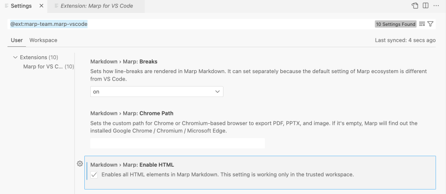

# Slide Template using `marp`

This repo is a template to create slides using the `marp` slide framework with the vs code extension. 

See the official marp repo [here](https://github.com/marp-team/marp)

## Why Use This
This is a quick and sustainable way to make slides from markdown files without worrying about formatting/placement/alignment of slide content. 

It is suitable for simple layouts, more complex layouts require more coding in `html` and `css`

## Setup 

### Install the extension
Install the following vs-code extension at [link](https://marketplace.visualstudio.com/items?itemName=marp-team.marp-vscode)

### Setup HTML option
For Multi-columns to work, enable the HTML option in the Settings as shown below.

## How to export slides
1. Click on the icon indicated by the arrow 

2. The command palette should show up.

3. Click the `Export` Button

- You can choose either PDF, HTML or PPTX file extensions.
- Only the HTML export will have transitions enabled.
- Note that the exports are not editable, eg: the exported PPTX text will not be editable

## Theme Customisation 

### The following settings are done in theme and style sections
  - Font Size 
    - Set different font size for headers and general font size
    - Note that: Font Size in pixels and points are different scales
  - Setup for either 2 or 3 columns layout in the slide 
    - use `
` or `
`

## Some usage examples
Some syntax examples are included in the [template](slides.md)
1. `---` is used to denote a separate slide
2. `` will set the height to 12cm, with center alignment, img url can be a web link or a local file.
3. ``can be used to set text size only on a particular slide
4. Customise a specific slide background `` 

## How to use this template

In order to use this template, You may just use the file in your own working folder.
1. [slides.md](slides.md)
